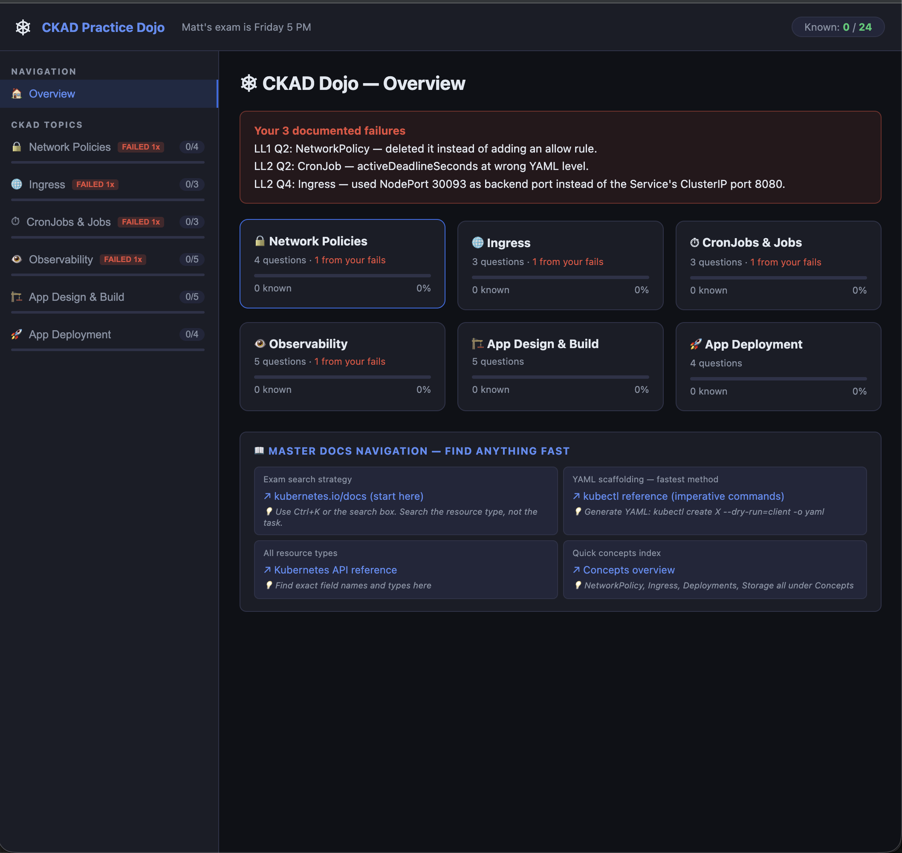

# CKAD Practice Dojo

A single-file browser app for drilling CKAD weak spots before exam day.

## What it does

- Organizes practice questions by CKAD topic (Network Policies, Ingress, CronJobs & Jobs, Observability, App Design & Build, App Deployment)
- Tracks which questions you've answered correctly ("Known") per topic
- Logs documented failures — mistakes you've made before — so you don't repeat them
- Includes a quick-reference nav panel with links to the Kubernetes docs, `kubectl` imperative commands, and YAML scaffolding tips

## Usage

Just open `index.html` in a browser. No build step, no dependencies.
